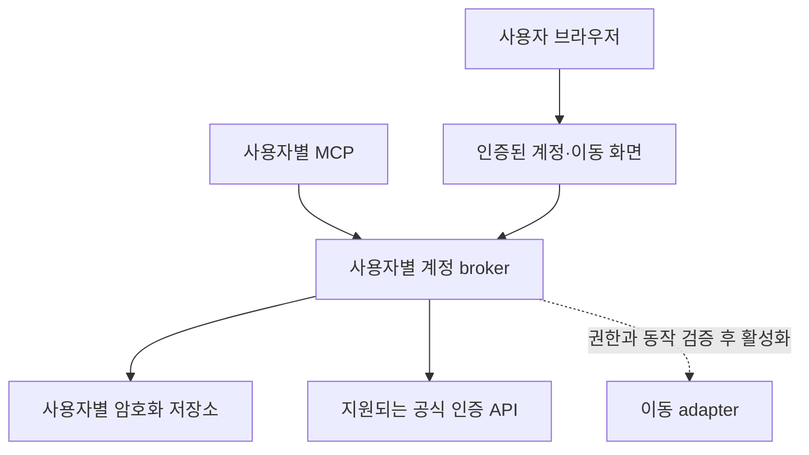

# 사용자별 계정·세션과 은신처 이동 설계

상태: 설계안. 기준: 0.12.0 / `67c403297340d2abd30b303c416e673724251fd3`.
작성·공식 문서 확인: 2026-09-10. 이 문서는 구현·배포 완료를 의미하지 않는다.

## 1. 제품 계약과 확인된 제약

사용자가 계정을 한 번 연결하면 연결 정보와 기본 계정 선택은 재시작·배포·ChatGPT
대화 변경 뒤에도 유지한다. 지원되는 인증 방식은 자동 갱신하고, 재인증이 필요해지면
연결 정보와 추천을 보존한 상태에서 로그인 화면으로 안내한다. 다른 사용자의 계정이나
운영자의 계정으로 대신 실행하지 않는다.

**GGG 세션이 영원히 만료되지 않는 기능은 보장할 수 없다.** 공식 OAuth 문서는
confidential client의 access token 수명을 28일, refresh token 수명을 90일로 설명한다.
갱신된 refresh token은 이전 토큰의 만료 시각을 물려받으며 사용한 토큰은 즉시 만료된다.
실제 access 만료 시각은 응답의 `expires_in`을 사용한다. 재동의 없이 refresh 기한을
연장하는 기능을 만들지 않는다. 만료 없는 client-credentials 토큰은 사용자별 계정
위임의 대체 수단이 아니다.
[공식 인증 문서](https://www.pathofexile.com/developer/docs/authorization)

공개 scope 목록에서 은신처 이동 권한은 확인되지 않았다. OAuth 계정 연결만으로 공식
거래소의 브라우저 로그인이나 이동 권한이 생긴다고 가정하지 않는다. 현재 문서에는
신규 API 애플리케이션 등록 중단도 명시되어 있다. 기존 등록 앱과 필요한 grant 사용
가능 여부는 별도 확인 사항이며, 새 client ID를 즉시 발급받을 수 있다고 전제하지 않는다.
[공식 개발자 문서](https://www.pathofexile.com/developer/docs)

0.12 조사에서 전달받은 공식 프런트엔드 소스 분석은 `hideout_token`을 사용한 JSON
POST 경로를 보여준다. 실제 인증 조건, 서버 간 호출 지원, 계정·IP·게임 세션과의 결합,
최종 도착 확인은 검증되지 않았다. 근거와 한계는 [0.12 기록](review-012.md)에 있다.
GGG와 Kakao를 동일 인증 제공자로 취급하지 않는다.

| 관리 대상 | 지속성 계약 | 만료·로그아웃 처리 |
|---|---|---|
| 서비스 사용자와 계정 연결 | 사용자가 해제할 때까지 보존 | 상류 인증 만료로 연결 기록을 지우지 않음 |
| Cloudflare Access 인증 | 현재 issuer/audience/owner 검증 유지 | 만료 시 정상 재인증, 임의 연장 없음 |
| GGG OAuth 자격증명 | 지원되는 grant 범위에서 자동 갱신 | refresh 절대 기한·철회 존중, 재로그인 안내 |
| 공식 거래소 웹 세션 | 우선 사용자 브라우저가 관리 | 갱신 규약 미확인, 서버 자동 연장 약속 없음 |
| 매물의 이동 토큰 | 검증된 이동 adapter 내부에서만 단기 사용 | 실행 직전 재취득, 장기 보관·공유 없음 |
| 우리 서비스의 이동 요청 | 인증된 사용자에 묶인 일회용 요청 | 제안 TTL 2분, 만료 시 새 요청 생성 |

## 2. 현재 배포에 추가할 구성

현재 owner/guest별 MCP·PoB worker·character provider·볼륨 분리를 유지한다.
각 사용자에 `account-broker`를 하나 추가한다. HTTP UI는 Cloudflare 인증 뒤에 두고,
MCP는 해당 사용자의 전용 Unix socket으로 broker의 닫힌 API를 호출한다.
broker가 자격증명 저장·갱신·계정 검증을 담당하며 PoB worker에는 연결하지 않는다.

`AccessVerifier.verify()`는 현재 인증 성공 여부만 판단하고 claims를 반환하지 않는다.
이를 검증된 최소 `Principal(member_id, issuer, subject)`을 반환하도록 확장하고
서버 내부 request context에 넣는다. JWT·쿠키·Authorization 헤더를 MCP 앞에서 제거하는
현재 동작은 유지한다. user ID·email·storage path를 도구 입력으로 받지 않는다.

`member_id`는 기존 배포의 불변 사용자 ID다. 첫 연결 때 인증된 subject를 귀속시키고,
이후 email 문자열 일치만으로 새 subject에 기존 계정을 넘기지 않는다. UI 로그인과
Managed OAuth의 subject 대응은 실제 배포에서 확인한다. 대응이 다르면 검증된 서버
매핑으로 처리한다. URL 경로나 모델이 전달한 값만으로 사용자를 결정하지 않는다.

broker는 배포 설정의 단일 member에 고정한다. socket·볼륨은 그 사용자의 프로세스에만
마운트하고, 내부 호출에서도 다른 member를 선택하는 필드는 제공하지 않는다.
기존 Ninja refresh session은 별도 서비스의 자격증명이다. GGG/Kakao 이동에 재사용하지 않는다.

## 3. 데이터 모델

초기 3인 배포에는 broker별 SQLite로 충분하다. broker만 DB를 열고 마이그레이션과
갱신 작업을 소유한다. 모든 연결·세션·작업은 명시적인 계정 외래키로 연결한다.

| 엔터티 | 주요 필드 | 불변식 |
|---|---|---|
| `UserIdentity` | member_id, issuer, subject, retired_at | 다른 사람에게 저장소 ID 재할당 금지 |
| `GameAccountLink` | account_id, provider, provider_account_id, display_name, verified_at, default_for_travel, link_epoch | 계정 식별자는 상류에서 검증, 표시 이름으로 소유권 판단 금지 |
| `Credential` | account_id, kind, scopes, encrypted_payload, key_version, credential_version, access_expires_at, refresh_absolute_expires_at, next_refresh_at, retry_after, status | provider·account·kind마다 격리, refresh 기한을 갱신 시 늘리지 않음 |
| `AccountCapability` | account_id, capability, availability, reason, verified_at, adapter_version | profile 인증과 travel 권한은 별개 |
| `LinkAttempt` | hashed_state, member_id, browser_binding, provider, encrypted_pkce_verifier, expires_at, consumed_at | 일회용, 제안 TTL 10분 |
| `TravelIntent` | intent_id, member_id, account_id, link_epoch, listing_ref, provider, realm, league, quoted_price, expires_at, status | 계정·매물 고정, 링크 소지만으로 실행 불가 |
| `TravelReceipt` | intent_id, account_id, listing_ref, attempted_at, status, reason_code, adapter_version | 토큰·판매자 정보·HTTP 원문 없이 결과 추적 |

계정은 여러 개 연결할 수 있고 기본 이동 계정은 최대 하나다. 기본 계정을 바꾸어도
이미 생성한 이동 요청의 계정은 바뀌지 않는다. 사용자가 계정을 바꿔 이동하려면 새 요청을
만든다. 연결 해제·재연결 때 `link_epoch`을 증가시켜 이전 이동 요청을 무효화한다.
정상 토큰 갱신은 `credential_version`만 증가시켜 계정 연결과 구분한다.

프로필 소유권은 OAuth 교환 결과와 인증된 프로필 응답으로 확인한다. GGG의 공개
`GET /profile`은 UUID와 표시 이름을 제공한다. UUID를 식별자로 저장하고 재연결 시
비교한다. 조회한 공개 캐릭터의 계정 이름만 입력한 상태는 `unverified`다.
[공식 프로필 API](https://www.pathofexile.com/developer/docs/reference#profile)

자격증명은 검증된 AEAD 라이브러리로 암호화한다. 추가 인증 데이터에 member·account·kind·
version을 결합하고 nonce를 재사용하지 않는다. 키는 DB와 분리해 운영 호스트의 비밀
저장소에서 broker 전용 파일로 공급한다. DB·키·socket은 다른 사용자 서비스에 마운트하지
않는다. HTTP 디버그 로그, 예외 본문, MCP 결과, URL, Git에는 비밀을 남기지 않는다.
호스트 관리자가 메모리·키에 접근할 수 있다는 기존 운영 신뢰 경계는 그대로다.

이동용 웹 세션 adapter를 추가할 때도 `ggg_oauth`와 별도의 `trade_web_session`으로
저장한다. 필요한 웹 인증의 등록·사용 경로가 확인된 경우에만 활성화하며, 브라우저에
로그인했다는 사실을 서버 세션 획득으로 간주하지 않는다. 서버 보관 방식이라면 사용자가
승인한 전용 연결 화면을 통해 자격증명을 전달하고, 계정 확인 전까지 격리 상태로 둔다.
사용자 브라우저가 실행 주체인 방식이라면 broker에는 검증된 연결 참조만 저장한다.
어느 방식을 지원할지는 실제 인증·이동 계약 확인 후 결정하며 현재 제공 가능한 것으로
표시하지 않는다.

서버가 웹 세션을 관리하는 adapter의 계약은 다음과 같다.

- 계정마다 별도 HTTP client와 cookie jar를 사용한다. 이름·값뿐 아니라 domain·path·
  expiry·Secure 속성을 보존하고, 허용된 제공자 origin 외에는 자격증명을 보내지 않는다.
- 검증된 정상 응답의 `Set-Cookie` 회전만 반영한다. 저장된 쿠키의 만료일을 바꾸거나
  임의 요청을 주기적으로 보내는 것으로 상류 세션 연장을 가정하지 않는다.
- `refresh_supported`, `session_expires_at`, `last_verified_at`, `travel_capability`를
  각각 기록한다. 만료 시각을 모르면 `unknown`이며 영구 세션이 아니다.
- 자동 갱신은 확인된 제공자 기능이 있을 때만 수행한다. 없다면 사용 직전 상태 확인과
  사용자 재로그인으로 복구하고, CAPTCHA·추가 인증이 나오면 로그인 화면으로 안내한다.
- 쿠키가 유효해도 이동 계정과 현재 게임 계정이 일치하는지는 별도 검증한다. 공식 사이트
  fallback에서는 사용자가 사이트에 표시된 계정을 확인해야 하며 broker가 검증했다고
  표시하지 않는다.

## 4. 연결·자동 갱신·해제

연결 화면은 사용자 계정으로 인증된 HTTPS 페이지다. 사용자는 제공자와 연결할 계정을
확인하고 공식 로그인·동의 화면으로 이동한다. 비밀번호·세션 쿠키를 ChatGPT에 입력하는
도구는 제공하지 않는다. 등록된 앱이 있으면 Authorization Code + PKCE로 시작하고,
정확한 redirect URI·state·브라우저 결합을 검증한다. callback은 인증 지연으로 코드를
소진하지 않도록 구성하되 owner 검증을 우회하는 공개 교환 경로는 만들지 않는다.

프로필 검증 뒤 계정과 토큰을 원자적으로 저장한다. 초기 scope는 계정 확인에 필요한
범위로 제한한다. 필요한 이동 grant가 확인되기 전에는 `travel=official_site_only`다.
GGG 앱 등록이 불가능한 배포에서는 공식 거래소 연결을 계속 제공하고, 계정 이름을
소유권 검증 완료로 표시하지 않는다. Kakao는 검증된 별도 제공자 구현이 있어야 활성화한다.

브로커의 갱신 정책은 다음과 같다.

1. access token의 남은 유효기간이 충분할 때 사용한다. 필요하면 실제 동작 직전에
   만료·scope·연결 상태를 다시 검사한다. 만료 시각이 없다는 이유로 무기한으로 간주하지 않는다.
2. 만료 전 안전 여유를 둔 `next_refresh_at`을 저장한다. 제안 기본값은 access 수명의
   마지막 10% 또는 마지막 24시간 중 짧은 구간 시작이며 소량의 jitter를 둔다.
   refresh 절대 기한에 도달한 뒤에는 추가 갱신을 예약하지 않는다.
3. 계정별 단일 갱신만 수행한다. DB transaction과 credential version CAS로 중복 교환을
   막고, 반환된 access·refresh 쌍을 한 transaction으로 교체한다. 응답 계정이 바뀌면 거부한다.
4. 회전 요청을 보낸 뒤 응답을 잃거나 저장 전에 프로세스가 죽으면 이전 refresh token이
   이미 소진됐을 수 있다. 성공을 추정하거나 무조건 재전송하지 않고 `reauth_required`로
   복구한다. 상류가 안전한 재시도 계약을 제공할 때만 예외를 둔다.
5. 429는 Retry-After를 보존한다. 연결 실패·일시 오류는 제공자 계약에 맞는 제한된 재시도로
   처리한다. 만료·철회 응답은 로그인 필요 상태, scope 부족은 capability 제한으로 처리한다.
   웹 challenge는 자동 해결하지 않고 해당 adapter를 `blocked`로 둔다.
6. 브로커 재시작 후 DB에서 예약을 복구한다. 갱신 성공으로 refresh 절대 만료일을 다시
   계산하지 않는다. 만료 7일·1일 전에는 계정 화면과 다음 도구 응답에서 재로그인을 안내한다.
   별도 메시지 전송이나 이메일은 이 설계의 기본 동작에 포함하지 않는다.

refresh token이 만료됐어도 access token이 아직 유효할 수 있다. `credential_status`와
`renewal_status`를 따로 두어 이를 표현한다. 상류 인증이 유효하더라도 게임 실행·거래
가능 상태는 별도이므로 온라인 또는 이동 가능으로 추정하지 않는다. 사용하지 않는
계정의 자동 유지 기능은 사용자가 끌 수 있다.

연결 해제는 먼저 계정을 사용 불가로 바꾸고 `link_epoch` 증가·대기 intent 취소를
transaction으로 처리한다. 이후 지원되는 공식 revoke와 비밀 삭제를 수행한다. 이미
전송된 이동은 취소를 보장하지 않는다. 진행 중 갱신 응답으로 해제된 계정이 되살아나지
않도록 저장 시 epoch도 검사한다. `remove-user`는 broker와 갱신 작업도 중단해야 한다.

백업 복구로 철회된 자격증명이 다시 활성화되지 않게 복구한 연결은 재검증 전 실행을
금지한다. 초기 보존 제안은 이동 receipt 30일, 소비한 단기 intent 최대 24시간이며,
토큰은 필요한 기간보다 오래 보존하지 않는다. 백업의 별도 보존 기간과 삭제 한계는
운영 문서에 기록한다.

## 5. ChatGPT에서 은신처 이동

현재 가능한 경로와 향후 실행 경로를 결과 타입에서 구분한다.

| `travel.mode` | 사용자에게 표시할 링크·동작 | 조건 |
|---|---|---|
| `official_site` | `공식 거래소에서 이동` | 현재 제공 가능, 사이트에서 로그인·계정 확인 후 공식 버튼 사용 |
| `broker_action` | `은신처 이동 열기` | 지원되는 인증·이동 adapter와 사용자 계정 결합을 검증한 뒤 활성화 |

`broker_action`의 흐름은 다음과 같다.

1. 추천 결과의 기존 `listing_ref`로 `prepare_hideout_travel`을 호출한다. 현재 사용자에게
   속한 검색·매물인지 확인하고 선택 계정과 원래 가격을 intent에 고정한다. 기본 검색의
   `securable` 조건을 유지한다. 매물 ID만 보고 이동 가능으로 판단하지 않는다.
2. 반환 URL은 `https://서비스호스트/u/사용자/travel/임의ID` 형태다. 임의 ID는 최소 128비트
   난수이며 계정 자격증명이 아니다. GET·HEAD·링크 미리보기는 안내 화면만 만든다.
   자동 JavaScript POST도 실행하지 않는다. `Cache-Control: no-store`, referrer 제한,
   외부 분석 스크립트 제외를 적용한다.
3. 화면에서 인증된 사용자가 계정·아이템·가격을 확인하고 `은신처로 이동`을 누르면
   같은 origin의 POST가 실행된다. CSRF·Origin·사용자 소유권·epoch·TTL을 검사한다.
   다른 사용자에게 전달한 링크는 실행되지 않는다.
4. 실행 adapter는 같은 계정으로 매물·가격·리그·이동 가능 상태를 다시 검증하고 유효한
   이동 토큰을 가져온다. 가격 변경·재판매·품절은 새 확인을 요구한다. 기존 검색 캐시나
   만료된 추천 receipt를 최신 거래 가능성의 근거로 사용하지 않는다.
5. intent를 원자적으로 `dispatching`으로 전환하고 계정별 하나의 이동만 진행한다.
   가능한 한 POST 직전 연결 해제를 재확인한다. 중복 클릭에는 기존 결과를 반환한다.
   상류에 요청을 보낸 뒤 타임아웃이 나면 `unknown`으로 기록하며 자동 재전송하지 않는다.
6. 상류 수락은 `accepted`로 표시한다. 실제 게임 도착을 확인할 독립 신호가 없다면
   `arrived`로 표시하지 않는다. 경쟁 매물 재시도·`continue`는 새 사용자 클릭을 요구한다.

**일반 ChatGPT Markdown 링크 한 번 클릭으로 인증된 POST를 보장할 수는 없다.**
초기 UX는 링크로 화면을 연 다음 실행 버튼을 누르는 두 단계다. 한 번의 명시적 클릭으로
완료하려면 인증된 POST를 지원하는 ChatGPT 액션 UI 또는 별도의 검증된 클라이언트 통합이
필요하다. 해당 UI 지원 여부는 이 설계에서 확인되지 않았으며 링크의 GET에 게임 동작을
붙여 대체하지 않는다.

브라우저의 공식 웹 세션을 서버가 가져오는 기능은 기본안에 포함하지 않는다. 향후 공식
지원 경로가 확인되면 전용 adapter에 추가한다. 쿠키를 저장하는 것만으로 권한·갱신·이동
지원이 해결된다고 가정하지 않는다. 구매 완료, 금 지출, 게임 접속 여부 등 부수 효과도
adapter 검증 범위에 포함하고 실제 확인한 범위만 화면에 표시한다.

## 6. MCP와 내부 인터페이스

| 도구 또는 경로 | 입력 | 공개 결과 |
|---|---|---|
| `get_game_accounts` | bounded page selector | 계정 ID·이름, 연결·갱신 상태, 만료 안내, travel capability |
| `begin_game_account_link` | provider | 인증된 연결 화면 URL, 지원 상태; 쿠키·비밀번호 입력 없음 |
| `set_default_game_account` | account_id | 변경된 기본 계정; 기존 intent 변경 없음 |
| `get_game_connection_status` | account_id | last_verified_at, renewal_due_at, next_action, capability reason |
| `prepare_hideout_travel` | listing_ref, account_id? | mode, account label, 가격, expires_at, URL |
| `get_hideout_travel_result` | intent_id | prepared / dispatching / accepted / failed / unknown / expired |
| 계정 UI의 disconnect POST | account_id, CSRF | 연결 해제 결과 |
| 이동 UI의 execute POST | intent_id, CSRF | 동일 intent의 실행 결과 |

계정이 하나면 기본값을 사용할 수 있다. 여러 계정인데 기본값이 없으면 선택을 요청한다.
`execute`는 일반 모델 도구로 먼저 노출하지 않는다. 추후 명시적인 사용자 액션과 결합해
노출할 경우 외부 게임 상태 변경을 도구 설명과 annotation에 명시한다.

DTO에는 raw token·cookie·client secret·판매자 계정·전체 상류 응답을 넣지 않는다.
`get_game_accounts`의 빈 결과는 `records=[]`를 유지한다. 예상 가능한 미연결·재로그인·
공식 사이트 전용 상태는 정상 structured result로 반환하고 MCP 계약 오류로 만들지 않는다.
관측되지 않은 만료 시각은 `null`과 근거 상태를 함께 반환한다.

## 7. 구현 순서와 완료 기준

1. **인증 지원 확인:** 기존 GGG client 등록·grant·profile scope 사용 가능 여부 확인.
   Kakao 인증과 이동 지원은 독립 확인. 이동 권한이 확인될 때까지 공식 사이트 경로 유지.
2. **계정 기반 구현:** typed principal, 사용자별 broker·암호화 store·연결 UI·계정 목록.
   토큰 없이도 서비스 기동 가능. 배포 경로에 계정·callback·travel UI의 사용자별 라우팅 추가.
3. **연결 유지 구현:** absolute refresh deadline, 회전·장애 복구, 재로그인 안내, 해제·사용자 제거.
4. **이동 구현:** 검증된 adapter가 있을 때 intent·실행 UI·receipt 활성화. 그렇지 않으면
   계정 기능이 배포되어도 `travel_link_supported=false`를 유지한다.

완료 판단은 다음 계약 테스트와 실제 사용자 검증으로 한다.

- Alice의 인증·계정·intent·매물로 Bob의 broker 또는 UI를 호출하면 실행·정보 공개 모두 거부.
- OAuth state 바꿔치기·다른 브라우저 callback·계정 불일치·같은 이름의 다른 UUID 거부.
- 동시 갱신·토큰 회전·응답 유실·재시작·절대 만료 경계에서 비밀 손실을 숨기거나 기한을 연장하지 않음.
- 연결 해제와 갱신/이동의 경쟁 상황, 기본 계정 변경, 백업 복구가 이전 권한을 되살리지 않음.
- GET·HEAD·미리보기·재클릭·만료 링크는 추가 게임 동작을 만들지 않음.
- 매물 가격 변경·품절·경쟁 상태·네트워크 타임아웃은 명확한 결과와 재시도 정책을 반환.
- 빈 계정 목록·미연결·재로그인 필요 결과를 실제 MCP session으로 호출해 outputSchema 검증.
- owner·guest 각각 공식 계정으로 연결하고 이동 계정이 맞는지 실사용 검증. 실제 이동을
  확인하지 않은 테스트는 `accepted` 이후 완료 근거로 사용하지 않음.

이 설계의 핵심 완료 조건은 장기 계정 연결, 지원 범위 내 자동 갱신, 사용자별 실행 귀속,
만료·철회·실행 불확실성을 정확하게 표시하는 것이다. 영구 세션이나 미검증 이동 지원을
제품 계약으로 내걸지 않는다.
