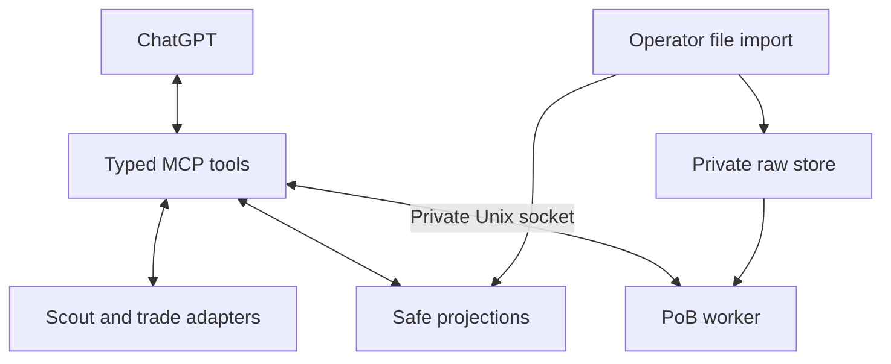

# Architecture and extension points

The model-facing process owns typed tool routing, market caches, retained trade searches, and bounded response serialization. The worker owns raw-file decoding and PoB execution. Imports happen outside the model process. Both processes trust validated identifiers and closed data models, not arbitrary file paths, scripts, or upstream text.

`scout.py` normalizes source prices and currencies. `trade.py` validates current metadata, throttles requests, retains listings, and produces safe views. `equipment.py` implements the explicit item-stat model. `engine.py` prepares bounded PoB scenarios and calls the private protocol. `engine_worker.py` executes the Lua integration in `lua/calculate.lua`. `builds.py` and `pob_io.py` implement projections and external file I/O.

## Extension rules

A future character provider should resolve stable provider/account/league identity, acquire permitted source data server-side, and import behind the existing raw boundary. Return a build ID and provenance, never a code or raw XML. A name may need disambiguation. Authentication and provider-specific rate limits belong in the provider layer. Live character and poe.ninja providers are not present in this release.

Add metric support by updating closed schemas, engine extraction, compatibility rules, and meaningful synthetic tests together. Maintain explicit unknown values and configuration scope. Do not change a saved summary into a recalculated result without changing its contract.

A multi-user service needs user authorization on every private identifier, isolated storage, quotas, and authenticated MCP discovery. The current opaque IDs do not replace access control. Keep these changes separate from game API authentication.

The public interfaces should remain bounded and deterministic. Long jobs may eventually require asynchronous job handles; do not extend limits indefinitely or stream arbitrary engine logs into model context.
