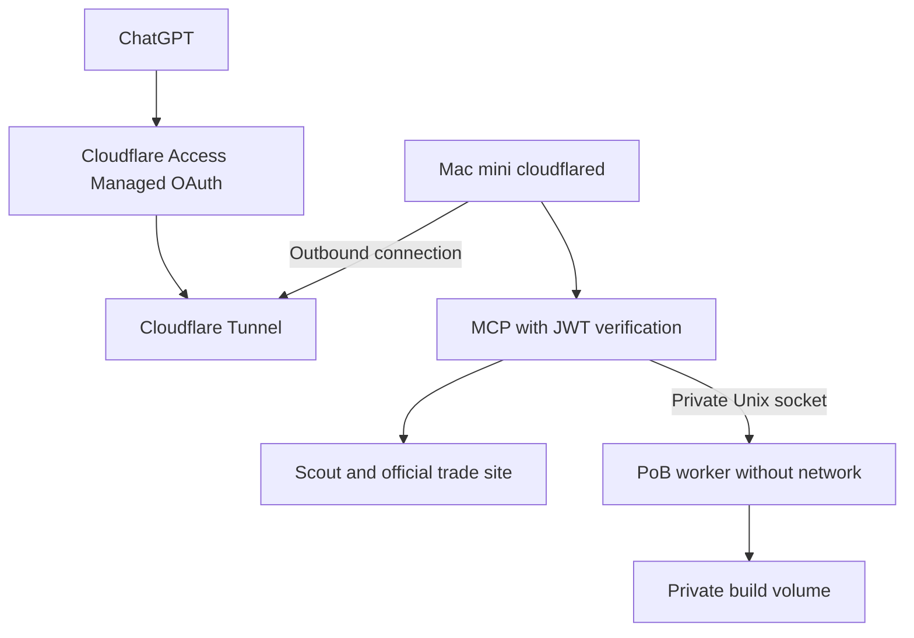

# Mac mini behind an inbound firewall

Run the Linux containers inside a dedicated Colima VM. A native `cloudflared`
process connects outward to Cloudflare and forwards requests to Mac loopback.
Use Cloudflare Access **Managed OAuth** for ChatGPT login and the built-in
Access JWT verifier at the origin. No inbound port, public IP, or OpenAI API key
is required. This is a single-owner deployment.



The public endpoint is `https://poe2.example.com/mcp`. Substitute a subdomain
you control. The tunnel serves the whole hostname so OAuth discovery also works.
Managed OAuth is currently marked **Beta** by Cloudflare; the final acceptance
test must include your actual ChatGPT account and Cloudflare configuration.

## 1. Install the Mac prerequisites

Use macOS 13 or later, an existing Homebrew installation, and a normal logged-in
operator account. Apple Silicon uses native Linux ARM64; Intel uses Linux amd64.
The supplied Colima profile allocates 4 CPUs, 8 GiB RAM and a 64 GiB virtual disk.
Reserve additional disk space for container build caches. Adjust these values in
`scripts/mac.py` before starting if necessary.

```bash
brew install colima docker docker-compose cloudflared python@3.12
docker compose version
git clone https://github.com/Dev-Jahn/poe2-gpt.git
cd poe2-gpt
```

If Docker cannot find Compose, follow `brew info docker-compose` to register
Homebrew's CLI plugin, then repeat `docker compose version`. Use Compose v2 with
`up --wait` support. Existing Docker Desktop or Colima profiles can remain in
place: the helper always selects `colima-poe2-gpt` and does not activate it as the
default Docker context. Do not start Homebrew's default Colima service for this
deployment. The helper installs its own named login services.

## 2. Create the Access application before exposing the tunnel

In the Cloudflare account that owns your domain:

1. Open **Zero Trust → Access controls → Applications** and create a
   **Self-hosted** application for `poe2.example.com`, covering all paths.
2. Add an **Allow** policy with **Emails** containing only your own login email.
   Use an identity provider or Access email login. Do not add an Everyone or
   Bypass rule. The origin independently checks that same owner email.
3. Open **Advanced settings → Managed OAuth**, enable it, and save. Enable
   dynamic client registration for the ChatGPT connection.
4. Allow the **exact redirect URI shown by ChatGPT's connection management UI**.
   Current ChatGPT connections may use the stable
   `https://chatgpt.com/connector_platform_oauth_redirect` or a connection-specific
   `https://chatgpt.com/connector/oauth/{callback_id}`. Use the actual value for
   your connection. Do not allow all HTTPS redirects. Localhost/loopback redirects
   are unnecessary for ChatGPT web; enable them only if testing a local MCP client.
5. Start with a 15-minute access-token lifetime and a 7-day grant session.
6. Record your team hostname, such as `your-team.cloudflareaccess.com`, and this
   application's **Application Audience (AUD) Tag** from its additional settings.

Managed OAuth supplies discovery, registration, login and refresh. A plain Access
browser login page alone is insufficient for an MCP client. ChatGPT presents an
opaque OAuth token to Cloudflare; Cloudflare forwards a signed
`Cf-Access-Jwt-Assertion` to this server. The server verifies RS256, issuer,
audience, expiry and owner email before dispatching any MCP request. Partial auth
configuration prevents startup. Cached signing keys refresh automatically;
expired keys with an unreachable key service fail closed.

## 3. Create a remotely managed tunnel

In **Zero Trust → Networks → Connectors → Cloudflare Tunnels**, create a
Cloudflared tunnel named, for example, `poe2-mac-mini`. Add a published application:

| Setting | Value |
|---|---|
| Public hostname | `poe2.example.com` |
| Path | Leave empty: all paths |
| Service type | HTTP |
| Origin URL | `localhost:18080` |
| HTTP Host Header | Leave unchanged; preserve the public hostname |

Cloudflare creates the proxied DNS route in your zone. Resolve any existing DNS
record conflict before proceeding. Do not route this hostname to another local
service. Copy **only the tunnel token** from Cloudflare's install command; do not
execute its system-wide service installer or put the token in shell arguments.
The helper runs an isolated native tunnel service with a private token file.

Tunnel traffic needs outbound UDP 7844 (QUIC) or TCP 7844 (HTTP/2), plus ordinary
DNS/HTTPS access. If UDP is filtered, cloudflared's auto mode can use HTTP/2 on
TCP 7844. TCP 443 by itself does not provide the tunnel transport. Leave inbound
firewall rules unchanged. Avoid browser challenges and response caching on this
MCP hostname; retain Access authentication.

## 4. Configure and start

Run these commands directly in your Mac terminal. The first command asks for
the team hostname, AUD, owner email and a hidden tunnel token.

```bash
python3.12 scripts/mac.py configure --hostname poe2.example.com --engine
python3.12 scripts/mac.py start
python3.12 scripts/mac.py install-login
python3.12 scripts/mac.py status
```

Omit `--engine` from `configure` for a prices/trade-only installation. To enable
it later, set `"engine": true` in the local `deployment.json` and run `start`.
Disabling it also requires stopping the now-unused `pob-engine` container.

Configuration and the 0600 token file live under `~/.config/poe2-gpt/`, outside
Git. The token is neither a container environment variable nor a command-line
argument. The server's origin is only published at `127.0.0.1:18080`.
`install-login` briefly stops and restarts **only** the dedicated Colima profile
so launchd can supervise it. Wait for the VM to finish starting before `status`.
The two LaunchAgent labels are `ai.poe2-gpt.colima` and `ai.poe2-gpt.tunnel`.

The loopback auth check must report **expected 403**. That confirms the origin
rejects unauthenticated calls; it does not establish Cloudflare, Scout or trade
availability. Containers should be healthy and the tunnel should show connected
in Cloudflare. Colima/Cloudflared service logs are in the same private config
directory; Docker logs rotate. Keep service log files bounded during maintenance.

## 5. Connect ChatGPT and test

Create a remote MCP connection using `https://poe2.example.com/mcp` and **OAuth**.
Select dynamic registration where the UI offers a registration method. Copy its
displayed callback URL into Access's Managed OAuth redirect allowlist, save, and
complete login as the allowed owner. No Cloudflare API token or tunnel token goes
into ChatGPT. Review the tools, then start a new conversation.

Verify in this order:

1. OAuth discovery returns JSON and an unauthenticated MCP client receives a
   `401` with OAuth discovery in `WWW-Authenticate`, rather than only an HTML
   login redirect. Test with a non-browser client; browser navigation may differ.
2. Another email is denied. Your account can initialize MCP and list tools.
3. `list_leagues`, `list_currency_categories` and a currency quote return data
   with source timestamps. Test trade status and a small equipment search.
4. With the engine enabled, check `get_pob_engine_status`, then import a build
   using the **operator terminal** command below and test calculation by build ID.
5. Let an access token expire and confirm the next tool call refreshes it. Test
   recovery after a network disconnect and a supervised Colima restart.

If login returns an HTML page, check Managed OAuth and callback registration.
If the origin returns 403 after login, check team/AUD/owner settings. A 503
authentication response indicates the configured signing-key service could not
be refreshed. A Cloudflare 502 usually indicates the VM or origin is unavailable.
Do not work around these errors by disabling origin auth or bypassing Access.

## Private builds and operation

```bash
# Operator terminal only. The file is streamed directly into an isolated importer.
python3.12 scripts/mac.py import-build --input /absolute/path/to/build.pob
```

Only an opaque build ID is printed. The importer is an ephemeral, network-disabled
container with raw/projection write access. It writes 0600 files as UID 10001 into
separate Linux-native named volumes. This avoids macOS shared-folder UID/ACL
translation. The worker mounts raw data read-only; MCP mounts only projections
and the worker socket. Raw code/XML never passes through a model tool. Export
remains an operator-only original-file operation; changed-build export is not
implemented. Keep this Mac's private data out of model-accessible filesystem
connectors as well.

For maintenance, use `python3.12 scripts/mac.py stop`. It stops this login session;
remove the two matching files in `~/Library/LaunchAgents/` to disable future login
startup. Rotate a tunnel credential in Cloudflare and run `set-token` locally.
For an update, review and check out the desired commit/tag, then run `start` to
rebuild and recreate containers. Keep the previous commit for rollback. Avoid
unattended PoB engine changes during a league.

The VM's named volumes persist across ordinary restarts and rebuilds. Do not use
`docker compose down --volumes` or `colima delete poe2-gpt` for maintenance: those
remove private data. Retain your original PoB exports in a separate encrypted
backup so they can be re-imported; generated IDs then change. To preserve IDs and
all volume data, stop the VM and back up its profile and disk together using your
Mac backup procedure. Verify restore before relying on that backup.

Disable automatic system sleep while on power in macOS settings; display sleep
and locking the screen can stay enabled. These LaunchAgents start after user
login, not before it. FileVault may require a local unlock after a reboot/power
failure. This setup does not silently enable automatic login or disable disk
encryption. A UPS and a planned unlock/restart procedure improve availability.

## References

- [Cloudflare Managed OAuth](https://developers.cloudflare.com/cloudflare-one/access-controls/applications/http-apps/managed-oauth/)
- [Access JWT validation](https://developers.cloudflare.com/cloudflare-one/access-controls/applications/http-apps/authorization-cookie/validating-json/)
- [Tunnel firewall requirements](https://developers.cloudflare.com/cloudflare-one/networks/connectors/cloudflare-tunnel/configure-tunnels/tunnel-with-firewall/)
- [Tunnel token-file parameter](https://developers.cloudflare.com/cloudflare-one/networks/connectors/cloudflare-tunnel/configure-tunnels/run-parameters/)
- [Colima setup](https://colima.run/docs/getting-started/)
- [ChatGPT OAuth requirements](https://developers.openai.com/plugins/build/auth)
- [ChatGPT connection guide](https://developers.openai.com/plugins/deploy/connect-chatgpt)
